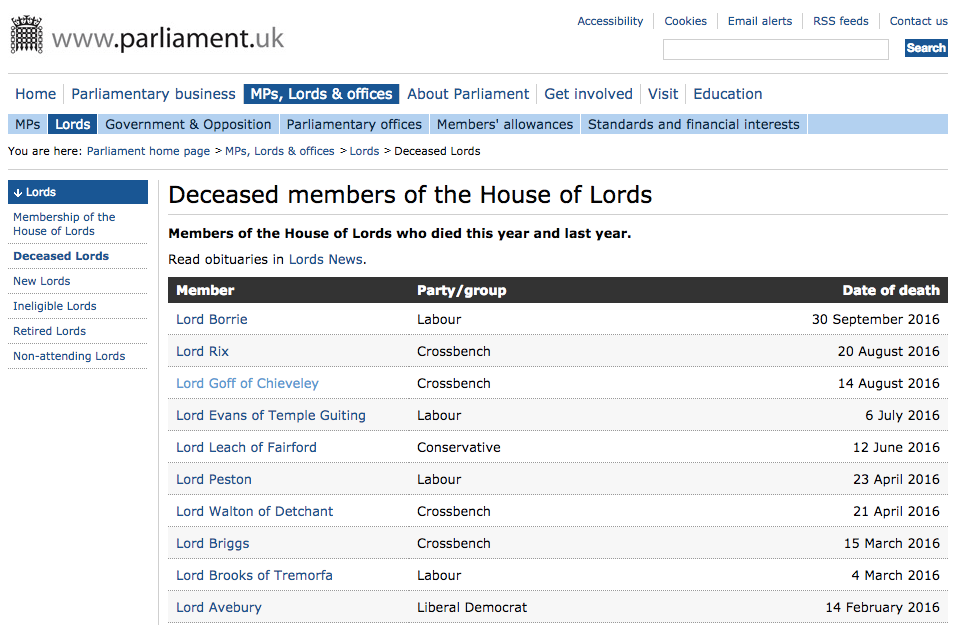
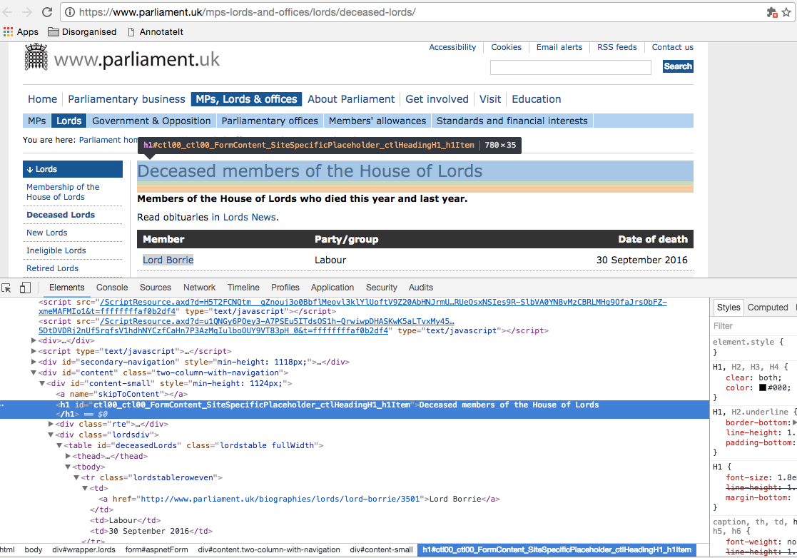
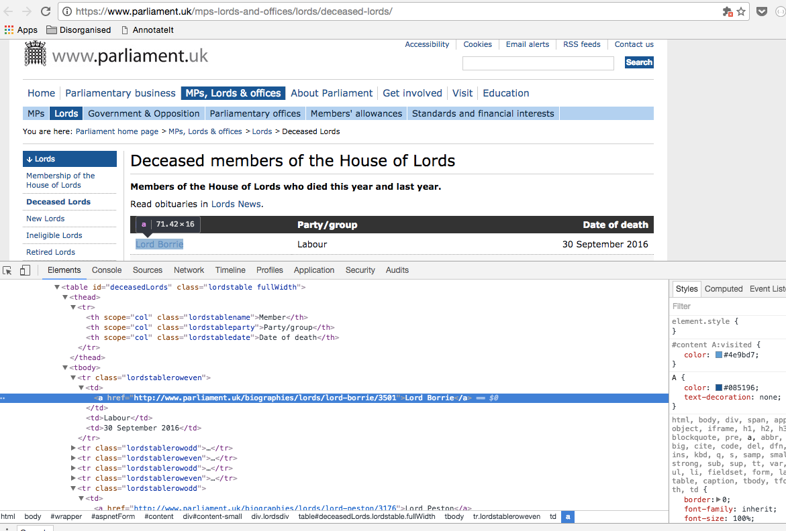

## What does data look like on a website?

___

Data can be contained on a single page like the movies produced by [Peter Jackson on IMDB](http://www.imdb.com/name/nm0001392/?ref_=nv_sr_3) or data can be contained in multiple pages like this [Pfizer data](http://www.pfizer.com/responsibility/working_with_hcp/payments_report)

---

## Internet
of tubes

---

## Web
of interconnected documents

___

Somewhat simplistically;

When you go to a web page, your browser asks another computer for the address of the computer for the website you want... and then goes and asks this computer for the website.

The computer that you ask in both cases are servers. Computers that are always on - are servers

The cloud, which you have heard about is another computer, a server. Any cloud you use is just someone elses computer.

---

## HTML

`

`

`<h1></h1>`

___

HTML is markup and it describes to your browser the structure of a document. An HTML tag has a beginning `
` and an end `
` - which looks the same but with a slash.

In an ideal world HTML has a start tag and end tag, even when nested tags, but it isn't always. Browsers are pretty forgiving

This document formatting can help us when we scrape, as we can use the markup to help us extract data.

---

## Room inspection

___

There is some language you will have to understand.

* HTML is the language in which documents on the internet are described
* The DOM is how the browser understands HTML

If you “View source” on a web page you will be able to see see how HTML looks behind any page on the internet. [Developer tools](https://developer.chrome.com/devtools) in Chrome or [Firebug](http://getfirebug.com/) a plugin for Firefox can help you understand the internals of a page by letting you do the following:

* “Inspect element” function lets you understand the HTML of any element you can see on a page. If you right click with Chrome and you have Developer tools installed. You will be able to see how a web page is made up.
* Network view shows you all the things that get downloaded when you open a page.

---

---

___

When you select a tag in the inspector - it highlights the tag in the the regular view.

It also shows the classes and ids that set a tag apart.

These attributes help us to select specific tags on a page.

---

So lets try an scrape all the names!

___

(https://www.parliament.uk/mps-lords-and-offices/lords/deceased-lords/)

